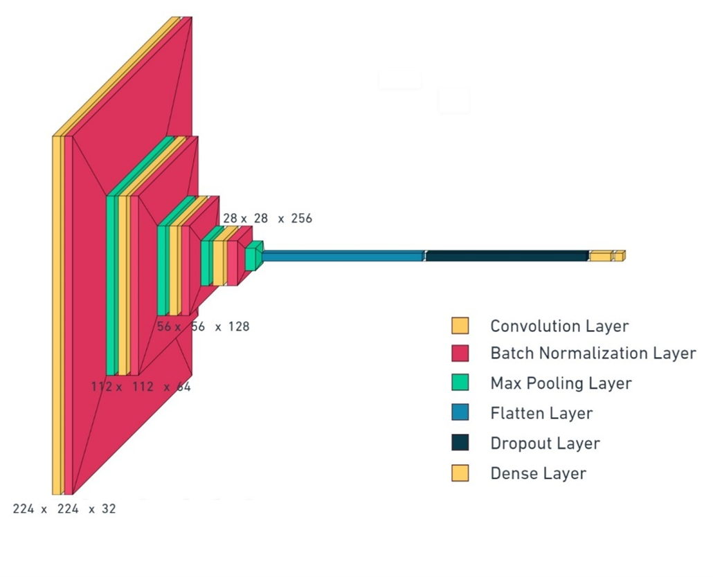
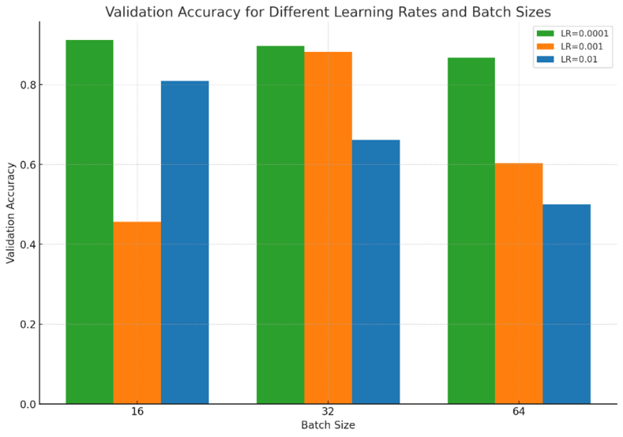
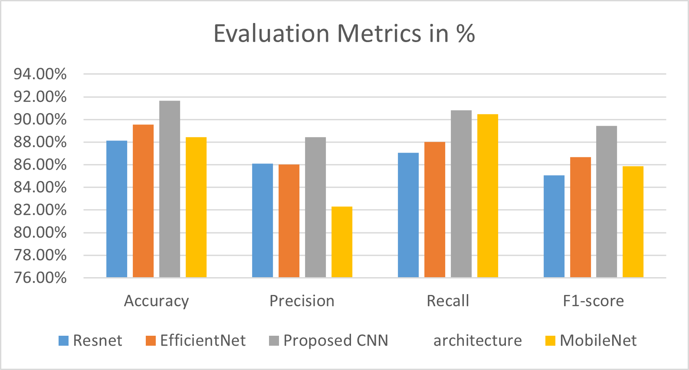

# Evaluating Biglycan as a Biomarker in Breast Cancer Detection (Proposed CNN + Benchmarks)

This repository contains the implementation (training + evaluation) for **breast cancer detection using Biglycan (BGN) biomarker histopathology images**. The work proposes a **VGG-style CNN trained from scratch** and benchmarks it against popular pretrained backbones (**ResNet, MobileNet, EfficientNet**).

> **Paper (Springer)**: [https://link.springer.com/chapter/10.1007/978-3-031-82389-3_18](https://link.springer.com/chapter/10.1007/978-3-031-82389-3_18)

---

## Authors / Ownership

**Code & research implementation:**

* **Anish Samantaray**
* **M. Poonkodi**

**Affiliation:** School of Computer Science and Engineering, **Vellore Institute of Technology (VIT), Chennai, India**

### Usage Notice

This code is shared strictly for **academic and research purposes**.

* Do **not redistribute** this repository or use it for **commercial purposes** without explicit permission.
* If you use this work, please **cite the Springer chapter** (see Citation section).

---

## Project Summary

Breast cancer remains a major global health challenge, where delays in laboratory-based diagnosis can negatively impact early detection. This project evaluates **Biglycan (BGN)** as a biomarker for breast cancer detection using **IHC-stained histopathology images**.

Key contributions:

* Utilization of a **Biglycan breast cancer dataset (v3)** with 336 samples
* Proposal of a **custom CNN architecture trained from scratch**
* Benchmarking against **ResNet, MobileNet, and EfficientNet**
* **10-fold cross-validation** with accuracy, precision, recall, and F1-score evaluation

---

## Dataset

* **Dataset:** Biglycan Breast Cancer Dataset (Version 3)
* **Total images:** 336

  * Healthy: 133
  * Cancer: 203
* **Type:** Histopathology tissue microscopy images (IHC / DAB stained)
* **Format:** PNG
* **Typical image size:** 128×128 (resized to 224×224 during training)

> ⚠️ Ensure you have proper access rights before using the dataset.

---

## Preprocessing

The following preprocessing steps were applied:

1. Resize images to **224×224**
2. Optional brightness/contrast enhancement to highlight stained regions
3. Conversion to tensors
4. Pixel normalization (0–255 → 0–1)
5. Stratified splitting / cross-validation to preserve class balance

---

## Models

### 1) Proposed CNN (Trained From Scratch)

A lightweight **VGG-style CNN** consisting of four convolutional blocks followed by a dense classifier.

**Architecture overview:**

* Conv2D(32, 3×3) → BatchNorm → MaxPool(2×2)
* Conv2D(64, 3×3) → BatchNorm → MaxPool(2×2)
* Conv2D(128, 3×3) → BatchNorm → MaxPool(2×2)
* Conv2D(256, 3×3) → BatchNorm → MaxPool(2×2)
* Flatten → Dropout(0.5)
* Dense(512, ReLU)
* Dense(1, Sigmoid)

### 2) Benchmark Models (Transfer Learning)

* **ResNet** – deep residual baseline
* **MobileNet** – lightweight and efficient baseline
* **EfficientNet** – accuracy–efficiency tradeoff baseline

For all pretrained models, the final classification head is replaced for **binary classification**.

---

## Results

Experimental results reported in the study:

* **Proposed CNN Accuracy:** **91.68%**
* **EfficientNet Accuracy:** **89.57%** (second-best)

Additional metrics include **precision, recall, and F1-score**, averaged across folds.

---

## Figures


### Proposed CNN Architecture


### Validation Accuracy vs Learning Rate & Batch Size


### Accuracy, Precision, Recall, and F1 Comparison


---

## How to Run

> Update paths and scripts based on whether the implementation uses **TensorFlow/Keras** or **PyTorch**.

### 1) Create virtual environment

```bash
python -m venv .venv
# Windows
.\.venv\Scripts\activate
# macOS/Linux
source .venv/bin/activate
```

### 2) Install dependencies

```bash
pip install -r requirements.txt
```

### 3) Prepare dataset

```text
data/
  healthy/
  cancer/
```

### 4) Train model

```bash
python train.py
```

### 5) Evaluate model

```bash
python evaluate.py
```

---

## Citation

If you use this work, please cite the following Springer publication:

**Samantaray, A., Poonkodi, M., Johnvictor, A. C. (2025).**
*Evaluating Biglycan as a Biomarker in Breast Cancer Detection: A Custom CNN Architecture.*
In: Sivakumar, P. D., Ramachandran, R., Pasupathi, C., Balakrishnan, P. (eds)
**Computing Technologies for Sustainable Development.**
First International Research Conference (IRCCTSD 2024), Chennai, India, May 9–10, 2024.
*Communications in Computer and Information Science*, vol. **2360**.
Springer, Cham.
[https://doi.org/10.1007/978-3-031-82389-3_18](https://doi.org/10.1007/978-3-031-82389-3_18)

### BibTeX

```bibtex
@incollection{samantaray2025biglycan,
  title     = {Evaluating Biglycan as a Biomarker in Breast Cancer Detection: A Custom CNN Architecture},
  author    = {Samantaray, Anish and Poonkodi, M. and Johnvictor, Anita Christaline},
  booktitle = {Computing Technologies for Sustainable Development},
  series    = {Communications in Computer and Information Science},
  volume    = {2360},
  year      = {2025},
  publisher = {Springer, Cham},
  doi       = {10.1007/978-3-031-82389-3_18},
  note      = {First International Research Conference (IRCCTSD 2024), Chennai, India, May 9--10, 2024}
}
```

---

## Contact

For questions, collaboration, or permission requests:

* **Anish Samantaray** (anish.samantaray2020@vitalum.ac.in)
* **M. Poonkodi** – School of Computer Science and Engineering, VIT Chennai

---

## Disclaimer

This repository is intended for **research and educational purposes only**. It is **not a medical device** and must not be used for clinical diagnosis or decision-making without appropriate regulatory approval and validation.
